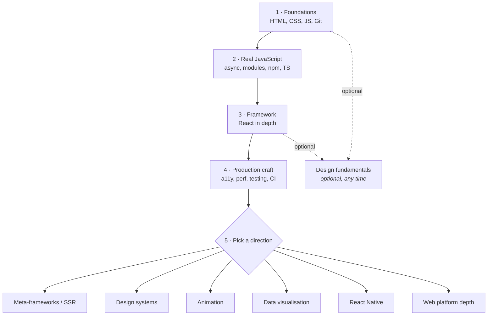

# Roadmap

[English](ROADMAP.md) · [O'zbekcha](ROADMAP.uz.md)

An ordered path from zero to employable frontend developer, in five stages.
Part of the [Frontend Roadmap](README.md).

The [topic files](README.md#contents) tell you *what to read* and
[docs/LEARNING.md](docs/LEARNING.md) tells you *where to learn it*. This file tells
you *in what order*, *when to stop*, and *what to build in between*. It is
deliberately opinionated: at every fork it names one default and explains when to
pick something else. A roadmap that lists every option is just the search results
page again.

## How to read this

- **Stages are sequential.** Stage 3 on a shaky stage 2 is the single most common
  way to get stuck, and no amount of extra React tutorials fixes it.
- **The "Learn" lists are capped at six topics.** That cap is the point. The topic
  files hold more than you need; these are the ones that pay off now.
- **A stage is finished when you can do the things in its checklist**, not when
  you've read the links. The checklists are written as actions for that reason.
- **Time estimates assume ~10–15 hours a week** and are ranges because prior
  experience swings them enormously. End to end this is roughly 8–12 months.

## If you already know something

| You are | Start at | Skip, but skim | Do not skip |
| --- | --- | --- | --- |
| Complete beginner | Stage 1 | — | — |
| Backend developer | Stage 1, fast | JS fundamentals, Git | CSS layout — it is not "the easy bit", and it is where you will lose weeks |
| Designer moving to code | Stage 1 | Design fundamentals, stage 5 design systems | JavaScript fundamentals in full — do not skim stage 2 |
| Bootcamp graduate | Stage 2 | Whatever the bootcamp covered properly | Stage 4 — bootcamps almost never teach a11y, testing, or CI |
| Wordpress / no-code builder | Stage 1, from CSS | HTML basics | Stage 2 — templating is not programming |
| Knows React from tutorials | Stage 2 | React syntax | Async JS and TypeScript, then redo stage 3 properly |

## Stage 1 · Foundations

You learn to turn a picture of a page into a page that works everywhere. By the
end you can build and deploy a static, responsive, semantically correct site by
hand — no framework, no build step, no copied template. Everything after this
stage assumes you can do that without thinking about it.

**Prerequisites** — none. This is the start.

**Time** — 8–12 weeks, assuming ~10–15 hours a week.

**Learn** — in this order:

1. Semantic HTML and document structure — [docs/HTML.md#reference](docs/HTML.md#reference)
2. What "bad markup" looks like, so you stop writing it — [docs/HTML.md#practice](docs/HTML.md#practice)
3. CSS fundamentals: the cascade, specificity, the box model — [docs/CSS.md#reference](docs/CSS.md#reference)
4. Layout with flexbox and grid, until it is boring — [docs/CSS.md#practice](docs/CSS.md#practice)
5. JavaScript fundamentals: values, functions, arrays, objects, control flow — [docs/JAVASCRIPT.md#learn](docs/JAVASCRIPT.md#learn)
6. Git: commit, branch, merge, resolve a conflict — [docs/GIT.md#practice](docs/GIT.md#practice)

Set your editor up once and stop fiddling with it — VS Code with a formatter and a
linter ([docs/TOOLING.md#tools](docs/TOOLING.md#tools)) is the whole requirement at
this stage. Browser devtools
([docs/TOOLING.md#debugging-and-inspection](docs/TOOLING.md#debugging-and-inspection))
you learn by using: keep the Elements and Console panels open from day one.

**Build** — two things, both deployed to a public URL:

- **A three-page personal site.** No CSS framework, no template. Requirements:
  zero errors from the W3C validator ([docs/HTML.md#reference](docs/HTML.md#reference));
  no horizontal scrollbar at any width from 320px to 1440px; every image
  compressed ([docs/DESIGN.md#converters--optimizers](docs/DESIGN.md#converters--optimizers));
  navigable with `Tab` alone; hosted on GitHub Pages with the source in a public repo.
- **A faithful rebuild of one screen from a real design.** Take a free Figma file
  ([docs/DESIGN.md#figma-templates](docs/DESIGN.md#figma-templates)) and match it.
  Requirements: layout built only with flexbox and grid — no absolute positioning
  and no fixed pixel heights on containers; spacing and type sizes taken from the
  design rather than eyeballed; one breakpoint you chose because the layout broke,
  not because 768px is a number people use.

**You are ready for stage 2 when** — you can honestly say:

- You can centre a box three different ways and say which one you would use here, and why.
- You can turn a two-column desktop layout into a one-column mobile one without looking up flexbox syntax.
- You can open devtools on any element and explain which rule is winning and which one lost to specificity.
- You can take a page written entirely in `
`s, rewrite it with semantic elements, and say what each one buys you.
- You can branch, commit, merge, and fix a merge conflict from the command line, with no GUI to rescue you.

## Stage 2 · Real JavaScript

You stop writing scripts and start writing programs. This stage is about the
things that separate "I did the JavaScript course" from "I can build a feature
against a real API": asynchrony, modules, the package ecosystem, a build tool,
and enough TypeScript to stop shipping `undefined is not a function`.

**Prerequisites** — stage 1, in full. Do not negotiate with yourself about this.

**Time** — 8–12 weeks, assuming ~10–15 hours a week.

**Learn** — in this order:

1. The event loop, promises, and `async`/`await` — [docs/JAVASCRIPT.md#learn](docs/JAVASCRIPT.md#learn)
2. The DOM, events, and browser APIs ([docs/BROWSER-APIS.md#reference](docs/BROWSER-APIS.md#reference)) — the platform under the framework
3. HTTP and fetching data, including the failure cases — [docs/JAVASCRIPT.md#learn](docs/JAVASCRIPT.md#learn) and [docs/JAVASCRIPT.md#utilities](docs/JAVASCRIPT.md#utilities)
4. ES modules, npm, and what a lockfile is for — [docs/JAVASCRIPT.md#node--npm](docs/JAVASCRIPT.md#node--npm)
5. A modern build tool ([docs/TOOLING.md#build-tools-and-bundlers](docs/TOOLING.md#build-tools-and-bundlers)) — **use Vite**, not the older tools in that list
6. TypeScript basics — the first four chapters of [docs/TYPESCRIPT.md#learn](docs/TYPESCRIPT.md#learn), and no further yet

> [!WARNING]
> [docs/JAVASCRIPT.md#node--npm](docs/JAVASCRIPT.md#node--npm) still lists Bower,
> Gulp, and Webpack. Bower has been deprecated for years and Gulp is rare in new
> frontend work; Webpack is worth recognising because you will meet it in older
> codebases, but do not learn it first. Start new projects with Vite.

**Build** — one application, then convert it:

- **A dashboard against a public REST API** — a GitHub profile viewer, a weather
  board, whatever holds your interest. Requirements: scaffolded with Vite; no
  framework; loading, empty, error, and success states each rendered explicitly
  and each verified by throttling or blocking the request in devtools; a search
  or filter that does not fire a request on every keystroke; ESLint
  ([docs/JAVASCRIPT.md#node--npm](docs/JAVASCRIPT.md#node--npm)) passing with no
  disabled rules; deployed.
- **Then port it to TypeScript** with `strict: true` and zero `any` — including
  the API response, typed from the real payload rather than guessed.

**You are ready for stage 3 when** — you can honestly say:

- You can predict the output order of a mix of synchronous code, `setTimeout`, and resolved promises, and explain why.
- You can read an unfamiliar API's docs and consume it, handling the 404 and the 500 as deliberately as the 200.
- You can start a project with Vite, add a dependency, and explain what the lockfile does and why it is committed.
- You can type a function that takes an object and returns some of its keys, without reaching for `any`.
- You can find a bug with a breakpoint and a watch expression instead of a trail of `console.log`.

## Stage 3 · Framework

You learn one framework properly. Depth in one beats familiarity with three: the
concepts transfer, the syntax does not, and no employer has ever been impressed
by a shallow list. **The default here is React** — it has the largest job market
and by far the largest pool of free material, which matters most when you are
learning alone and get stuck.

Pick something else if:

- **Vue** — you want one official, batteries-included stack (router, store, docs) maintained by one team instead of assembling your own.
- **Svelte** — you want the least boilerplate and are building small-to-medium apps where ecosystem size is not the constraint.
- **Angular** — you are targeting enterprise or large-team roles, especially in Europe, where it is heavily represented in listings.

Whichever you pick, finish this stage with it before looking at another.

**Prerequisites** — stages 1 and 2. Especially the async part of stage 2.

**Time** — 10–14 weeks, assuming ~10–15 hours a week.

**Learn** — in this order:

1. Components, props, state, and the rendering model — [docs/REACTJS.md#reference](docs/REACTJS.md#reference)
2. Hooks, and the rules that govern them — [docs/REACTJS.md#practice](docs/REACTJS.md#practice)
3. Component architecture and composition patterns — [docs/REACTJS.md#practice](docs/REACTJS.md#practice) and [docs/REACTJS.md#deep-dives](docs/REACTJS.md#deep-dives)
4. Why things re-render, and how to see it — [docs/REACTJS.md#practice](docs/REACTJS.md#practice)
5. Routing, forms, and server-state fetching ([docs/REACTJS.md#data-fetching](docs/REACTJS.md#data-fetching)) — the three things every real app needs
6. Typing components and props — [docs/TYPESCRIPT.md#deep-dives](docs/TYPESCRIPT.md#deep-dives)

Reach for a component library ([docs/UI-FRAMEWORKS.md#tools](docs/UI-FRAMEWORKS.md#tools))
when you are building an application; build your own components when you are
learning what they are made of. Do both, in that order.

> [!WARNING]
> [docs/REACTJS.md#practice](docs/REACTJS.md#practice) lists Create React App,
> which is deprecated and no longer recommended by the React team. Start React
> projects with Vite, or with a meta-framework once you reach stage 5.

**Build** — one substantial app and one component:

- **A CRUD application against a real API** — not local state, not a mock array.
  Requirements: list, detail, create, edit, and delete; routing such that every
  view is deep-linkable and the back button behaves; a hard refresh on any route
  works, including a 404 route; forms with validation that never lose what the
  user typed when submission fails; pending and error states on every mutation;
  no `any` in the codebase.
- **One reusable component, built in isolation** with Storybook
  ([docs/REACTJS.md#practice](docs/REACTJS.md#practice)) — a modal or a custom
  select. Requirements: fully keyboard operable, including `Escape` and focus
  trapping or arrow-key navigation as appropriate; works controlled and
  uncontrolled; every state has a story.

**You are ready for stage 4 when** — you can honestly say:

- You can explain, using devtools, why a component re-rendered, and remove an unnecessary re-render without guessing.
- You can decide whether a piece of state belongs in a component, a parent, the URL, or a server cache — and defend the choice.
- You can add a route to an existing app, with its loading and not-found states, without copying another route wholesale.
- You can build a form with async submission and validation that survives a failed request intact.
- You can read a stack trace from a framework error and get to the line in your own code that caused it.

## Stage 4 · Production craft

This is the stage that separates people who can build a demo from people who can
ship. Everything here is what a code review at work will actually be about, and
almost none of it appears in tutorials. It is also the cheapest place to
differentiate yourself: most junior portfolios fail an accessibility audit in the
first ten seconds.

**Prerequisites** — stage 3, with an app you can apply all of this to.

**Time** — 6–10 weeks, assuming ~10–15 hours a week.

**Learn** — in this order:

1. Accessibility ([docs/ACCESSIBILITY.md](docs/ACCESSIBILITY.md)) — keyboard operability, focus management, accessible names, and when ARIA is the wrong answer
2. Performance and Core Web Vitals ([docs/PERFORMANCE.md#core-web-vitals](docs/PERFORMANCE.md#core-web-vitals)) — measure first; check dependency cost with [docs/JAVASCRIPT.md#node--npm](docs/JAVASCRIPT.md#node--npm) and image weight with [docs/DESIGN.md#converters--optimizers](docs/DESIGN.md#converters--optimizers)
3. Testing ([docs/TESTING.md](docs/TESTING.md)) — unit, component, and one end-to-end path through the app
4. Security basics ([docs/SECURITY.md](docs/SECURITY.md)) — XSS, CSP, and where tokens may and may not be stored ([docs/JAVASCRIPT.md#jwt](docs/JAVASCRIPT.md#jwt))
5. Deployment and CI ([docs/DEPLOYMENT.md#cicd](docs/DEPLOYMENT.md#cicd)) — a pipeline, not a person, decides whether main is releasable
6. Cross-browser reality — check support before you use it, with [docs/JAVASCRIPT.md#utilities](docs/JAVASCRIPT.md#utilities)

**Build** — do not start a new project. Take the stage 3 app and harden it:

- **An accessibility and performance pass.** Requirements: Lighthouse
  accessibility score of 100 with no rule suppressed; every interactive element
  reachable by keyboard with a visible focus ring; the primary flow completed once
  with a screen reader; Largest Contentful Paint under 2.5s on a simulated slow
  connection; a written note of the single biggest cost you found and what you did
  about it.
- **A pipeline.** Requirements: every pull request runs lint, tests, and a
  production build, and a failure blocks the merge; a preview deploy per pull
  request; a green main branch that deploys itself.

**You are ready for stage 5 when** — you can honestly say:

- You can use your own application from start to finish with the mouse unplugged.
- You can read a performance trace and name the one thing worth fixing, instead of applying every suggestion in the report.
- You can write a test that fails when you break the feature and passes when you fix it, and say why you tested at that level.
- You can explain XSS and CSP with a concrete example from your own code.
- You can ship to production from a pull request with no manual checklist held in your head.

## Stage 5 · Depth and specialisation

Pick **one** direction and go deep enough to be the person on the team who knows
it. This stage has no completion date and no checklist — it is the part of the
job that continues. What follows is a handful of pointers per direction, not a
curriculum.

**Prerequisites** — stage 4.

**Time** — 8+ weeks per direction, assuming ~10–15 hours a week; genuinely open-ended.

**Meta-frameworks and SSR** ([docs/FRAMEWORKS.md#react-meta-frameworks](docs/FRAMEWORKS.md#react-meta-frameworks)) — the most common next step, and the most hireable.

- Server-side rendering, static generation, and streaming: what each costs and what each buys.
- Data loading on the server, and the boundary between server and client components.
- Caching and revalidation — the hard part, and the part interviews ask about.
- Deploying something that has a server, not just static files.

**Design systems** — for people who like the seam between design and code.

- Design tokens: colour, type scale, and spacing as data ([docs/DESIGN.md#colors--gradients](docs/DESIGN.md#colors--gradients), [docs/DESIGN.md#converters--optimizers](docs/DESIGN.md#converters--optimizers)).
- Read how mature systems are structured before building one — [docs/UI-FRAMEWORKS.md#tools](docs/UI-FRAMEWORKS.md#tools).
- Component API design: variants, composition, and escape hatches.
- Documentation and versioning as first-class work, not an afterthought.

**Animation and motion** — high impact on portfolios, and undersupplied.

- Motion principles before syntax — [docs/CSS.md#practice](docs/CSS.md#practice).
- CSS transitions, keyframes, and what the compositor can animate cheaply — [docs/CSS.md#tools](docs/CSS.md#tools).
- The Web Animations API ([docs/BROWSER-APIS.md#modern-ui-platform-apis](docs/BROWSER-APIS.md#modern-ui-platform-apis)) and scroll-driven animation ([docs/CSS.md#animation-and-motion](docs/CSS.md#animation-and-motion)) for what CSS cannot express.
- `prefers-reduced-motion`, always. Motion that cannot be turned off is a bug.

**Data visualisation** — pairs unusually well with backend or analytics work.

- Start with a charting library and learn what it cannot do — [docs/JAVASCRIPT.md#data-visualization](docs/JAVASCRIPT.md#data-visualization).
- Then learn scales, axes, and data binding from first principles with D3 ([docs/JAVASCRIPT.md#data-visualization](docs/JAVASCRIPT.md#data-visualization)).
- SVG performance, and when to move to canvas.
- Accessible charts: a table alternative, and never colour as the only encoding.

**React Native and mobile** ([docs/FRAMEWORKS.md#cross-platform](docs/FRAMEWORKS.md#cross-platform)) — the shortest hop from React to a second platform.

- What transfers from React and what does not — layout, navigation, and gestures.
- Platform differences you cannot abstract away, and the native build toolchain.
- Store submission, code signing, and over-the-air updates.

**Web platform depth** — the specialisation that never goes out of date.

- Browser internals: parsing, the render pipeline, and layout — start from [docs/JAVASCRIPT.md#learn](docs/JAVASCRIPT.md#learn).
- Web Components, Shadow DOM, and where the platform now overlaps frameworks.
- Service workers, offline behaviour, and background sync.
- WebAssembly, WebGL, or WebRTC — pick according to what you want to build.

## What to skip

Time beginners lose to things that do not pay off early:

- **Memorising CSS properties.** [docs/CSS.md#reference](docs/CSS.md#reference) exists so you do not have to. Learn the cascade and layout; look up the rest forever.
- **Learning three frameworks at once.** Employers hire depth. Three shallow frameworks interview worse than one you actually understand.
- **jQuery.** You will meet it in old code and can learn it in an afternoon then. The platform absorbed it — see [docs/JAVASCRIPT.md#utilities](docs/JAVASCRIPT.md#utilities).
- **Algorithm grinding before you can build a page.** Frontend interviews are overwhelmingly practical. Do this later, targeted at the companies that ask.
- **Configuring Webpack by hand.** Vite defaults are fine. Build configuration is a skill you acquire when a real problem demands it.
- **Tutorial marathons.** The tenth tutorial teaches less than the first thing you build unaided. If you have not been stuck in a while, you are not learning.
- **Rewriting your portfolio site every month.** One good deployed project beats five restarts. Ship, then move on.
- **Waiting until you feel ready to apply.** You will not. Stage 4 finished, with the app to prove it, is enough.

## Contributing

Found something out of order, a stage that is unrealistic, or a missing
prerequisite? Open an issue — see [CONTRIBUTING.md](CONTRIBUTING.md). New
resources belong in the [topic files](README.md#contents), not here: this file
links to them so there is only ever one place to update.
