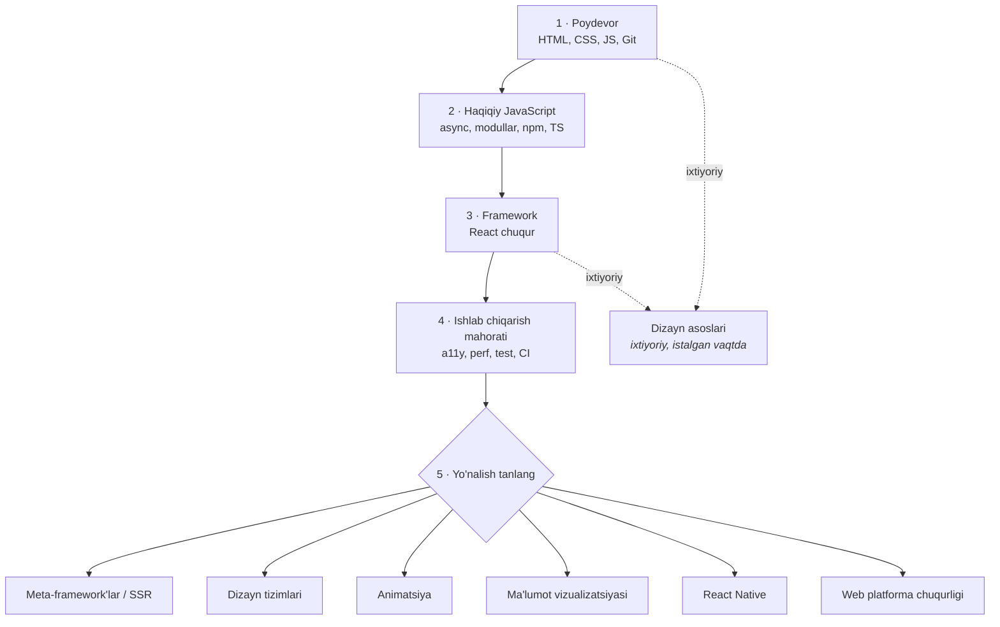

# Yo'l xaritasi

[English](ROADMAP.md) · [O'zbekcha](ROADMAP.uz.md)

Noldan ishga yaraydigan frontend dasturchigacha bo'lgan tartibli yo'l, besh
bosqichda. [Frontend Roadmap](README.uz.md) loyihasining bir qismi.

[Mavzu fayllari](README.uz.md#mundarija) *nima o'qish kerakligini*,
[docs/LEARNING.md](docs/LEARNING.md) esa *qayerda o'rganish kerakligini* aytadi. Bu
fayl *qaysi tartibda*, *qachon to'xtash* va *oralarida nima qurish* kerakligini
aytadi. U ataylab tanlov qiladi: har bir ayrilishda bitta asosiy variantni nomlaydi
va qachon boshqasini tanlash kerakligini tushuntiradi. Har bir variantni sanab
chiqadigan yo'l xaritasi — o'sha qidiruv natijalari sahifasining o'zi.

> [!NOTE]
> Havolalar ingliz tilidagi mavzu fayllariga olib boradi — sababi
> [docs/TRANSLATIONS.md](docs/TRANSLATIONS.md) da.

## Buni qanday o'qish kerak

- **Bosqichlar ketma-ket.** Zaif 2-bosqich ustiga qurilgan 3-bosqich — tiqilib
  qolishning eng keng tarqalgan yo'li, va uni qancha qo'shimcha React darsligi ham
  tuzatmaydi.
- **"O'rganing" ro'yxatlari oltita mavzu bilan cheklangan.** Bu chek — ataylab
  qo'yilgan. Mavzu fayllarida keragidan ko'proq narsa bor; bu yerdagilari esa aynan
  hozir foyda beradiganlari.
- **Bosqich havolalarni o'qib chiqqaningizda emas, ro'yxatdagi ishlarni bajara
  olganingizda tugaydi.** Ro'yxatlar shuning uchun harakat sifatida yozilgan.
- **Vaqt taxminlari haftasiga ~10–15 soatga mo'ljallangan** va oraliq ko'rinishida
  berilgan, chunki oldingi tajriba ularni juda kuchli o'zgartiradi. Boshidan
  oxirigacha bu taxminan 8–12 oy.
- **† bilan belgilangan mavzular** uchun `docs/` da hali fayl yo'q — ular
  [Mundarija](README.uz.md#mundarija) jadvalida *tez orada* deb turadi. Ular paydo
  bo'lguncha mavzu nomining o'zi sizning qidiruv so'rovingiz.

## Agar allaqachon biror narsani bilsangiz

| Siz kimsiz | Qayerdan boshlang | O'tkazing, lekin ko'z yugurtiring | O'tkazib yubormang |
| --- | --- | --- | --- |
| Mutlaqo yangi boshlovchi | 1-bosqich | — | — |
| Backend dasturchi | 1-bosqich, tez | JS asoslari, Git | CSS layout — bu "oson qismi" emas, va aynan shu yerda haftalab vaqt yo'qotasiz |
| Kodga o'tayotgan dizayner | 1-bosqich | Dizayn asoslari, 5-bosqichdagi dizayn tizimlari | JavaScript asoslarini to'liq — 2-bosqichga ko'z yugurtirib o'tib ketmang |
| Bootcamp bitiruvchisi | 2-bosqich | Bootcamp puxta o'tgan mavzular | 4-bosqich — bootcamp'lar a11y, test va CI'ni deyarli hech qachon o'rgatmaydi |
| Wordpress / no-code quruvchi | 1-bosqich, CSS'dan | HTML asoslari | 2-bosqich — shablon to'ldirish dasturlash emas |
| React'ni darsliklardan biladi | 2-bosqich | React sintaksisi | Async JS va TypeScript, so'ng 3-bosqichni qaytadan, puxta o'ting |

## 1-bosqich · Poydevor

Sahifaning rasmini hamma joyda ishlaydigan sahifaga aylantirishni o'rganasiz. Bosqich
oxirida statik, responsive va semantik jihatdan to'g'ri saytni qo'lda yozib, deploy
qila olasiz — framework yo'q, build bosqichi yo'q, ko'chirilgan shablon yo'q. Bundan
keyingi hamma narsa buni o'ylab o'tirmasdan qila olishingizni nazarda tutadi.

**Shartlar** — yo'q. Bu — boshlanish.

**Vaqt** — 8–12 hafta, haftasiga ~10–15 soat hisobida.

**O'rganing** — shu tartibda:

1. Semantik HTML va hujjat tuzilishi — [docs/HTML.md#reference](docs/HTML.md#reference)
2. "Yomon markup" qanday ko'rinishini — uni yozishni to'xtatishingiz uchun — [docs/HTML.md#practice](docs/HTML.md#practice)
3. CSS asoslari: cascade, specificity, box model — [docs/CSS.md#reference](docs/CSS.md#reference)
4. Flexbox va grid bilan layout — zerikarli bo'lib qolgunicha — [docs/CSS.md#practice](docs/CSS.md#practice)
5. JavaScript asoslari: qiymatlar, funksiyalar, massivlar, obyektlar, boshqaruv oqimi — [docs/JAVASCRIPT.md#learn](docs/JAVASCRIPT.md#learn)
6. Git: commit, branch, merge, conflict'ni hal qilish — [docs/GIT.md#practice](docs/GIT.md#practice)

Muharriringizni bir marta sozlang va u bilan ovora bo'lishni bas qiling — formatter
va linter o'rnatilgan VS Code ([docs/TOOLING.md#tools](docs/TOOLING.md#tools)) bu
bosqichdagi butun talab. Brauzer devtools† — uni ishlatib o'rganasiz: birinchi
kundanoq Elements va Console panellarini ochiq tuting.

**Quring** — ikkita narsa, ikkalasi ham ochiq URL'ga deploy qilingan:

- **Uch sahifali shaxsiy sayt.** CSS framework yo'q, shablon yo'q. Talablar: W3C
  validator ([docs/HTML.md#reference](docs/HTML.md#reference)) bitta ham xato
  bermasin; 320px dan 1440px gacha hech qanday kenglikda gorizontal scrollbar
  chiqmasin; har bir rasm siqilgan bo'lsin
  ([docs/DESIGN.md#converters--optimizers](docs/DESIGN.md#converters--optimizers));
  faqat `Tab` bilan boshqarib bo'lsin; GitHub Pages'da joylashtirilgan va manba kodi
  ochiq repoda bo'lsin.
- **Haqiqiy dizayndagi bitta ekranni aniq qayta qurish.** Bepul Figma faylini
  ([docs/DESIGN.md#figma-templates](docs/DESIGN.md#figma-templates)) oling va unga
  mos qiling. Talablar: layout faqat flexbox va grid bilan qurilsin — absolute
  positioning yo'q va konteynerlarda qat'iy piksel balandligi yo'q; masofalar va
  shrift o'lchamlari ko'z bilan chamalab emas, dizayndan olinsin; bitta breakpoint —
  uni 768px odamlar ishlatadigan raqam bo'lgani uchun emas, layout buzilgani uchun
  tanlang.

**2-bosqichga tayyorsiz, agar** — rostini aytib, shularni ayta olsangiz:

- Blokni uch xil usulda markazga qo'ya olasiz va bu yerda qaysi birini, nega ishlatishingizni ayta olasiz.
- Ikki ustunli desktop layoutni bir ustunli mobil layoutga flexbox sintaksisini qidirmasdan aylantira olasiz.
- Istalgan element ustida devtools'ni ochib, qaysi qoida yutayotganini va qaysi biri specificity'da yutqazganini tushuntira olasiz.
- To'liq `
` lardan iborat sahifani olib, uni semantik elementlar bilan qayta yoza olasiz va har biri nima berishini ayta olasiz.
- Buyruqlar satrida, hech qanday GUI yordamisiz branch ocha, commit qila, merge qila va merge conflict'ni tuzata olasiz.

## 2-bosqich · Haqiqiy JavaScript

Skript yozishni to'xtatib, dastur yozishni boshlaysiz. Bu bosqich "JavaScript kursini
tugatdim" bilan "haqiqiy API ustiga funksiya qura olaman" o'rtasidagi farqni
yaratadigan narsalar haqida: asinxronlik, modullar, paket ekotizimi, build vositasi va
`undefined is not a function` yuborishni to'xtatadigan darajadagi TypeScript.

**Shartlar** — 1-bosqich, to'liq. Bu haqda o'zingiz bilan savdolashmang.

**Vaqt** — 8–12 hafta, haftasiga ~10–15 soat hisobida.

**O'rganing** — shu tartibda:

1. Event loop, promise'lar va `async`/`await` — [docs/JAVASCRIPT.md#learn](docs/JAVASCRIPT.md#learn)
2. DOM, hodisalar va brauzer API'lari† — framework ostidagi platforma
3. HTTP va ma'lumot olish, xato holatlari bilan birga — [docs/JAVASCRIPT.md#learn](docs/JAVASCRIPT.md#learn) va [docs/JAVASCRIPT.md#utilities](docs/JAVASCRIPT.md#utilities)
4. ES modullar, npm va lockfile nima uchun kerakligi — [docs/JAVASCRIPT.md#node--npm](docs/JAVASCRIPT.md#node--npm)
5. Zamonaviy build vositasi† — o'sha ro'yxatdagi eskilarini emas, **Vite'ni ishlating**
6. TypeScript asoslari — [docs/TYPESCRIPT.md#learn](docs/TYPESCRIPT.md#learn) ning dastlabki to'rt bobi, hozircha undan nariga o'tmang

> [!WARNING]
> [docs/JAVASCRIPT.md#node--npm](docs/JAVASCRIPT.md#node--npm) da hali ham Bower,
> Gulp va Webpack bor. Bower yillar oldin deprecated bo'lgan, Gulp esa yangi frontend
> ishlarida kam uchraydi; Webpack'ni tanib olish foydali, chunki eski kod bazalarida
> unga duch kelasiz, lekin uni birinchi bo'lib o'rganmang. Yangi loyihalarni Vite
> bilan boshlang.

**Quring** — bitta ilova, so'ng uni o'giring:

- **Ochiq REST API ustiga qurilgan dashboard** — GitHub profil ko'ruvchisi, ob-havo
  taxtasi, sizni qiziqtirgan istalgan narsa. Talablar: Vite bilan yaratilgan;
  framework yo'q; loading, bo'sh, xato va muvaffaqiyat holatlarining har biri alohida
  chizilgan va har biri devtools'da so'rovni sekinlashtirib yoki bloklab tekshirilgan;
  har bir tugma bosilishida so'rov yubormaydigan qidiruv yoki filtr; ESLint
  ([docs/JAVASCRIPT.md#node--npm](docs/JAVASCRIPT.md#node--npm)) bitta ham qoidasi
  o'chirilmagan holda o'tadi; deploy qilingan.
- **So'ng uni TypeScript'ga ko'chiring** — `strict: true` bilan va bitta ham `any`
  ishlatmasdan; API javobi ham taxmin qilib emas, haqiqiy payload'dan tiplashtirilsin.

**3-bosqichga tayyorsiz, agar** — rostini aytib, shularni ayta olsangiz:

- Sinxron kod, `setTimeout` va bajarilgan promise'lar aralashmasining chiqish tartibini oldindan ayta olasiz va nega shundayligini tushuntira olasiz.
- Notanish API hujjatini o'qib, undan foydalana olasiz — 404 va 500 ni 200 kabi ongli ravishda qayta ishlaysiz.
- Vite bilan loyiha boshlay olasiz, dependency qo'sha olasiz va lockfile nima qilishini hamda nega u commit qilinishini tushuntira olasiz.
- Obyekt qabul qilib, uning ba'zi kalitlarini qaytaradigan funksiyani `any` ga murojaat qilmasdan tiplashtira olasiz.
- Xatoni qator-qator `console.log` o'rniga breakpoint va watch ifodasi bilan topa olasiz.

## 3-bosqich · Framework

Bitta framework'ni puxta o'rganasiz. Bittasini chuqur bilish uchtasi bilan yuzaki
tanishishdan afzal: tushunchalar bir-biriga o'tadi, sintaksis o'tmaydi va hech bir ish
beruvchi yuzaki ro'yxatdan taassurotlanmagan. **Bu yerdagi asosiy tanlov — React**:
uning ish bozori eng katta va bepul materiallari boshqalardan ancha ko'p, bu esa
yolg'iz o'rganib, tiqilib qolganingizda eng muhimi.

Boshqasini tanlang, agar:

- **Vue** — o'zingiz yig'ish o'rniga bitta jamoa qo'llab-quvvatlaydigan, hammasi qutida keladigan rasmiy to'plamni (router, store, hujjatlar) xohlasangiz.
- **Svelte** — eng kam boilerplate xohlasangiz va ekotizim hajmi cheklov bo'lmagan kichik-o'rta ilovalar qurayotgan bo'lsangiz.
- **Angular** — enterprise yoki katta jamoadagi ish o'rinlarini, ayniqsa Yevropada, mo'ljallayotgan bo'lsangiz: u yerdagi vakansiyalarda juda ko'p uchraydi.

Qaysi birini tanlasangiz ham, boshqasiga qaramasdan oldin shu bosqichni o'sha bilan
tugating.

**Shartlar** — 1 va 2-bosqichlar. Ayniqsa 2-bosqichning async qismi.

**Vaqt** — 10–14 hafta, haftasiga ~10–15 soat hisobida.

**O'rganing** — shu tartibda:

1. Komponentlar, props, state va rendering modeli — [docs/REACTJS.md#reference](docs/REACTJS.md#reference)
2. Hook'lar va ularni boshqaradigan qoidalar — [docs/REACTJS.md#practice](docs/REACTJS.md#practice)
3. Komponent arxitekturasi va kompozitsiya patternlari — [docs/REACTJS.md#practice](docs/REACTJS.md#practice) va [docs/REACTJS.md#deep-dives](docs/REACTJS.md#deep-dives)
4. Nima uchun qayta render bo'lishi va buni qanday ko'rish — [docs/REACTJS.md#practice](docs/REACTJS.md#practice)
5. Routing, formalar va server holatini olish† — har qanday haqiqiy ilovaga kerak bo'ladigan uchta narsa
6. Komponentlar va props'ni tiplashtirish — [docs/TYPESCRIPT.md#deep-dives](docs/TYPESCRIPT.md#deep-dives)

Ilova qurayotganingizda komponent kutubxonasiga
([docs/UI-FRAMEWORKS.md#tools](docs/UI-FRAMEWORKS.md#tools)) murojaat qiling;
komponentlar nimadan tuzilishini o'rganayotganingizda o'zingiznikini yozing.
Ikkalasini ham, shu tartibda qiling.

> [!WARNING]
> [docs/REACTJS.md#practice](docs/REACTJS.md#practice) da Create React App bor — u
> deprecated va React jamoasi endi uni tavsiya qilmaydi. React loyihalarini Vite
> bilan, 5-bosqichga yetganingizda esa meta-framework bilan boshlang.

**Quring** — bitta jiddiy ilova va bitta komponent:

- **Haqiqiy API ustiga qurilgan CRUD ilova** — lokal state emas, mock massiv emas.
  Talablar: ro'yxat, batafsil ko'rinish, yaratish, tahrirlash va o'chirish; routing
  shundayki, har bir ko'rinishga to'g'ridan-to'g'ri havola berish mumkin va orqaga
  tugmasi to'g'ri ishlaydi; istalgan route'da qattiq yangilash ishlaydi, 404 route ham
  shunga kiradi; yuborish muvaffaqiyatsiz bo'lganda foydalanuvchi yozgan narsani
  yo'qotmaydigan, validatsiyali formalar; har bir mutatsiyada kutish va xato
  holatlari; kod bazasida bitta ham `any` yo'q.
- **Alohida qurilgan bitta qayta ishlatiladigan komponent** — Storybook
  ([docs/REACTJS.md#practice](docs/REACTJS.md#practice)) bilan; modal yoki maxsus
  select. Talablar: to'liq klaviatura bilan boshqariladi, jumladan `Escape` va holatga
  qarab focus trapping yoki strelkalar bilan navigatsiya; controlled va uncontrolled
  rejimlarda ishlaydi; har bir holat uchun alohida story bor.

**4-bosqichga tayyorsiz, agar** — rostini aytib, shularni ayta olsangiz:

- Devtools yordamida komponent nega qayta render bo'lganini tushuntira olasiz va keraksiz qayta renderni taxminga tayanmasdan olib tashlay olasiz.
- Biror state komponentga, ota-komponentga, URL'ga yoki server cache'iga tegishlimi — hal qila olasiz va tanlovingizni himoya qila olasiz.
- Mavjud ilovaga yangi route'ni, uning loading va topilmadi holatlari bilan, boshqa route'ni butunlay ko'chirmasdan qo'sha olasiz.
- Asinxron yuborish va validatsiyaga ega, muvaffaqiyatsiz so'rovdan keyin ham buzilmaydigan forma qura olasiz.
- Framework xatosidagi stack trace'ni o'qib, sababchi bo'lgan o'z kodingizdagi qatorga yeta olasiz.

## 4-bosqich · Ishlab chiqarish mahorati

Bu — demo qura oladiganlarni mahsulot chiqara oladiganlardan ajratadigan bosqich. Bu
yerdagi hamma narsa ishdagi code review aslida nima haqda bo'lishini ko'rsatadi va
ularning deyarli hech biri darsliklarda uchramaydi. Shu bilan birga, bu — ajralib
turishning eng arzon joyi: ko'pchilik junior portfoliolari accessibility tekshiruvidan
birinchi o'n soniyadayoq yiqiladi.

**Shartlar** — 3-bosqich va bularning hammasini qo'llash mumkin bo'lgan ilova.

**Vaqt** — 6–10 hafta, haftasiga ~10–15 soat hisobida.

**O'rganing** — shu tartibda:

1. Accessibility† — klaviatura bilan boshqarish, fokusni boshqarish, accessible name'lar va ARIA qachon noto'g'ri javob ekani
2. Performance va Core Web Vitals† — avval o'lchang; dependency narxini [docs/JAVASCRIPT.md#node--npm](docs/JAVASCRIPT.md#node--npm) bilan, rasm og'irligini [docs/DESIGN.md#converters--optimizers](docs/DESIGN.md#converters--optimizers) bilan tekshiring
3. Test† — unit, komponent va ilova bo'ylab bitta end-to-end yo'l
4. Xavfsizlik asoslari† — XSS, CSP va token'larni qayerda saqlash mumkin, qayerda mumkin emasligi ([docs/JAVASCRIPT.md#jwt](docs/JAVASCRIPT.md#jwt))
5. Deployment va CI† — main relizga tayyormi yoki yo'qmi, buni odam emas, pipeline hal qiladi
6. Brauzerlararo haqiqat — ishlatishdan oldin qo'llab-quvvatlanishini [docs/JAVASCRIPT.md#utilities](docs/JAVASCRIPT.md#utilities) bilan tekshiring

**Quring** — yangi loyiha boshlamang. 3-bosqichdagi ilovani oling va uni mustahkamlang:

- **Accessibility va performance bo'yicha to'liq o'tish.** Talablar: Lighthouse
  accessibility bahosi 100, bitta ham qoida o'chirilmagan; har bir interaktiv
  elementga klaviatura bilan yetib boriladi va ko'rinadigan focus ring bor; asosiy
  oqim bir marta ekran o'quvchi bilan boshidan oxirigacha bajarilgan; sekin ulanish
  simulyatsiyasida Largest Contentful Paint 2.5s dan kam; topilgan eng katta xarajat
  va u bilan nima qilganingiz yozib qo'yilgan.
- **Pipeline.** Talablar: har bir pull request lint, testlar va production build'ni
  ishga tushiradi, xato esa merge'ni to'xtatadi; har bir pull request uchun preview
  deploy; o'zini o'zi deploy qiladigan yashil main branch.

**5-bosqichga tayyorsiz, agar** — rostini aytib, shularni ayta olsangiz:

- O'z ilovangizni sichqonchani uzib qo'yib, boshidan oxirigacha ishlata olasiz.
- Performance trace'ni o'qib, hisobotdagi har bir taklifni qo'llash o'rniga tuzatishga arziydigan bitta narsani ayta olasiz.
- Funksiyani buzganingizda yiqiladigan, tuzatganingizda o'tadigan test yoza olasiz va nega aynan shu darajada test yozganingizni ayta olasiz.
- XSS va CSP'ni o'z kodingizdagi aniq misol bilan tushuntira olasiz.
- Boshingizda qo'lda bajariladigan tekshiruv ro'yxatini saqlamasdan, pull request'dan production'ga chiqara olasiz.

## 5-bosqich · Chuqurlik va ixtisoslashuv

**Bitta** yo'nalish tanlang va jamoada uni biladigan odam bo'ladigan darajada
chuqurlashing. Bu bosqichning tugash sanasi ham, tekshiruv ro'yxati ham yo'q — bu
ishning davom etadigan qismi. Quyida har bir yo'nalish uchun o'quv dasturi emas,
bir nechta yo'nalgich berilgan.

**Shartlar** — 4-bosqich.

**Vaqt** — har bir yo'nalish uchun 8+ hafta, haftasiga ~10–15 soat hisobida; aslida chegarasi yo'q.

**Meta-framework'lar va SSR†** — eng ko'p tanlanadigan keyingi qadam va ishga joylashishga eng foydalisi.

- Server-side rendering, statik generatsiya va streaming: har biri nimaga tushadi va nima beradi.
- Serverda ma'lumot yuklash hamda server va client komponentlari o'rtasidagi chegara.
- Caching va revalidatsiya — eng qiyin qismi va suhbatlarda so'raladigani.
- Faqat statik fayllar emas, serveri bor narsani deploy qilish.

**Dizayn tizimlari** — dizayn bilan kod orasidagi chokni yoqtiradiganlar uchun.

- Design token'lar: rang, shrift shkalasi va masofalar — ma'lumot sifatida ([docs/DESIGN.md#colors--gradients](docs/DESIGN.md#colors--gradients), [docs/DESIGN.md#converters--optimizers](docs/DESIGN.md#converters--optimizers)).
- O'zingiznikini qurishdan oldin yetuk tizimlar qanday tuzilganini o'qing — [docs/UI-FRAMEWORKS.md#tools](docs/UI-FRAMEWORKS.md#tools).
- Komponent API dizayni: variantlar, kompozitsiya va zaxira yo'llari.
- Hujjat va versiyalash — keyin eslab qolinadigan narsa emas, birinchi darajali ish sifatida.

**Animatsiya va harakat** — portfolioga ta'siri katta, buni biladiganlar esa kam.

- Sintaksisdan oldin harakat prinsiplari — [docs/CSS.md#practice](docs/CSS.md#practice).
- CSS transition'lar, keyframe'lar va compositor nimani arzon animatsiya qila olishi — [docs/CSS.md#tools](docs/CSS.md#tools).
- CSS ifodalay olmaydigan narsalar uchun Web Animations API va scroll bilan boshqariladigan animatsiya†.
- `prefers-reduced-motion` — har doim. O'chirib bo'lmaydigan harakat — bu bug.

**Ma'lumot vizualizatsiyasi** — backend yoki analitika ishi bilan g'ayrioddiy darajada yaxshi qo'shiladi.

- Grafik kutubxonasidan boshlang va u nimani qila olmasligini o'rganing — [docs/JAVASCRIPT.md#charts](docs/JAVASCRIPT.md#charts).
- So'ng shkalalar, o'qlar va data binding'ni D3† bilan asosidan o'rganing.
- SVG unumdorligi va qachon canvas'ga o'tish kerakligi.
- Accessible grafiklar: jadval ko'rinishidagi muqobil, va rang hech qachon yagona belgi bo'lmasin.

**React Native va mobil†** — React'dan ikkinchi platformaga eng qisqa sakrash.

- React'dan nima o'tadi va nima o'tmaydi — layout, navigatsiya va imo-ishoralar.
- Yashirib bo'lmaydigan platforma farqlari va native build toolchain'i.
- Store'ga yuborish, code signing va over-the-air yangilanishlar.

**Web platformasi chuqurligi** — hech qachon eskirmaydigan ixtisoslik.

- Brauzer ichki tuzilishi: parsing, render pipeline va layout — [docs/JAVASCRIPT.md#learn](docs/JAVASCRIPT.md#learn) dan boshlang.
- Web Components, Shadow DOM va platforma hozir framework'lar bilan qayerda kesishishi.
- Service worker'lar, oflayn xatti-harakat va fondagi sinxronizatsiya.
- WebAssembly, WebGL yoki WebRTC — nima qurmoqchi ekaningizga qarab tanlang.

## Nimani o'tkazib yuborish kerak

Yangi boshlovchilar erta foyda bermaydigan narsalarga yo'qotadigan vaqt:

- **CSS xossalarini yodlash.** [docs/CSS.md#reference](docs/CSS.md#reference) aynan shuning uchun bor. Cascade va layoutni o'rganing; qolganini umr bo'yi qarab tursangiz bo'ladi.
- **Bir vaqtda uchta framework o'rganish.** Ish beruvchilar chuqurlikni yollaydi. Uchta yuzaki framework suhbatda haqiqatan tushunadigan bittasidan yomonroq ko'rinadi.
- **jQuery.** Unga eski kodda duch kelasiz va o'shanda uni yarim kunda o'rganib olasiz. Platforma uni o'ziga singdirdi — [docs/JAVASCRIPT.md#utilities](docs/JAVASCRIPT.md#utilities) ga qarang.
- **Sahifa qura olmasdan turib algoritm mashq qilish.** Frontend suhbatlari asosan amaliy. Buni keyinroq, so'raydigan kompaniyalarga mo'ljallab qiling.
- **Webpack'ni qo'lda sozlash.** Vite'ning standart sozlamalari yetarli. Build sozlash — haqiqiy muammo talab qilganda egallanadigan ko'nikma.
- **Darslik maratonlari.** O'ninchi darslik yordamsiz qurgan birinchi narsangizdan kamroq o'rgatadi. Anchadan beri tiqilib qolmagan bo'lsangiz, demak o'rganmayapsiz.
- **Har oyda portfolio saytini qaytadan yozish.** Bitta yaxshi deploy qilingan loyiha beshta qayta boshlashdan afzal. Chiqaring, so'ng oldinga yuring.
- **O'zingizni tayyor his qilguningizcha ariza bermay kutish.** His qilmaysiz. Tugatilgan 4-bosqich va uni isbotlaydigan ilova yetarli.

## Hissa qo'shish

Tartibi buzilgan narsani, real bo'lmagan bosqichni yoki tushib qolgan shartni
topdingizmi? Issue oching — [CONTRIBUTING.md](CONTRIBUTING.md) ga qarang. Yangi
resurslar bu yerga emas, [mavzu fayllariga](README.uz.md#mundarija) qo'shiladi: bu
fayl ularga havola qiladi, shunda yangilanadigan joy doim bitta bo'ladi.
